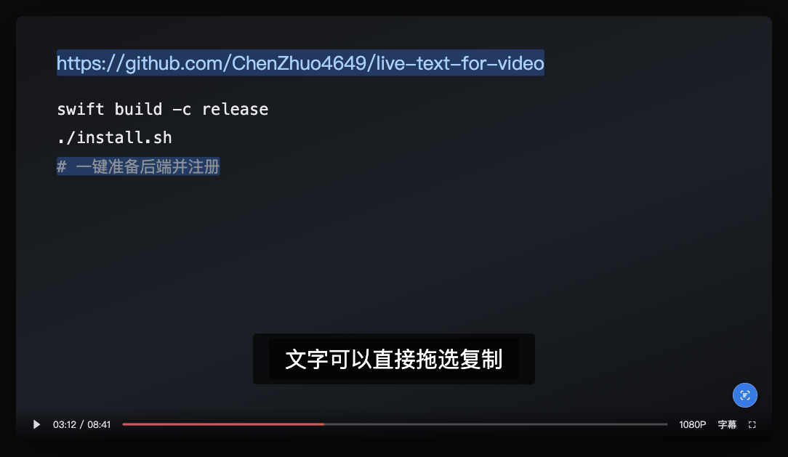

# Live Text for Video

[English](README.md) | [简体中文](README.zh-CN.md) | [日本語](README.ja.md) | [한국어](README.ko.md) | [Français](README.fr.md) | [Deutsch](README.de.md) | [Español](README.es.md) | **Русский**

**Поставьте видео на паузу → нажмите на значок в правом нижнем углу → текст на экране становится выделяемым.**

Распознавание выполняет **фреймворк Vision** от Apple — **тот же самый движок**, что и в Live Text у Safari, поэтому качество идентично.

Бонус: распознанный текст — это **настоящий слой DOM-текста**, поэтому словарные расширения вроде Yomitan могут искать слова при наведении курсора, без копирования.

> Это сокращённая версия. Полная — в [английском README](README.md).



> Поставьте видео на паузу и нажмите на значок — текст станет выделяемым. Синие участки показывают распознанный текст.

---

## Какую задачу решает

В Safari при паузе видео появляется кнопка Live Text, и текст на экране можно сразу выделять и копировать.

Chrome так не умеет — **песочница веб-страницы не имеет доступа к системному OCR**. Решения только на фронтенде могут лишь встроить в браузер универсальную OCR-модель, с заметно худшим качеством и скоростью.

Этот проект переносит такой опыт в Chrome с помощью **расширения Chrome + небольшого локального помощника**: расширение отвечает за интерфейс и захват кадра, помощник вызывает движок Vision от Apple.

---

## Требования

| Пункт | Требование |
|---|---|
| ОС | **macOS 13 или новее** (в более старых нет автоопределения языка) |
| Процессор | Apple Silicon или Intel (бэкенд — Universal Binary) |
| Браузер | Chrome / Edge / Brave / Vivaldi / Opera (на Chromium) |
| Для сборки бэкенда | Command Line Tools: `xcode-select --install` |

> **Windows / Linux не работают** — движок есть только в macOS.
> **Safari не поддерживается** — его API расширений несовместим с Chrome.

---

## Установка

### Шаг 1: клонировать и зарегистрировать

```bash
git clone https://github.com/ChenZhuo4649/live-text-for-video.git
cd live-text-for-video
./install.sh
```

Скрипт:

1. Проверит версию системы и архитектуру процессора
2. Подготовит OCR-бэкенд — пропустит, если есть рабочий, иначе соберёт **Universal Binary** локальным `swiftc`
3. **Зарегистрирует бэкенд во всех браузерах на Chromium** на этом Mac
4. Выведет шаги установки расширения

### Шаг 2: установить расширение

1. Откройте `chrome://extensions`
2. Включите **режим разработчика** (справа сверху)
3. Нажмите **«Загрузить распакованное расширение»** и выберите папку `extension/` из репозитория

Идентификатор расширения должен быть таким:

```
hmigekegioajglfmifdfofilgigpbcah
```

> **Этот ID вычисляется из встроенного открытого ключа и не зависит от пути установки.**
> Он одинаков на разных компьютерах, в разных папках и браузерах.

---

## Использование

1. Откройте любую страницу с видео
2. **Поставьте на паузу**
3. В **правом нижнем углу видео** появится маленький круглый значок
4. **Нажмите на него**
5. Подождите 0,5–1 с — текст станет выделяемым и **кратко мигнёт голубой подсветкой**, показывая, где он находится
6. **Выделите мышью → `Cmd+C`**
7. **Нажмите на значок снова**, чтобы скрыть

---

## Качество распознавания (измерено)

| Тип содержимого | Результат |
|---|---|
| URL, код, крупный контрастный текст | ✅ Идеально |
| Китайские / японские субтитры | ✅ Идеально |
| Плотный текст терминала | ✅ 72 % из 128 строк — идеально |
| Малоконтрастный серый текст | ❌ Не удаётся — но уверенность падает до 0,3, что позволяет отличить ненадёжные результаты |

Время: **0,5–1 с** для обычного кадра; около **1,1 с** для плотного экрана терминала.

---

## Язык

**По умолчанию — автоопределение языка** (через `automaticallyDetectsLanguage` в Vision): китайский, английский и японский работают сразу.

> **Почему нельзя передать `ja-JP` и `zh-Hans` вместе**: языковые пакеты Vision **взаимоисключающие**.
> Если передать оба, китайский «ояпонивается» в традиционные или японские варианты кандзи
> (师→姉, 试→試, 给→給, 这→汶), и обработка идёт почти вдвое дольше.
> Измерено на одном и том же японском экзаменационном снимке: только `zh-Hans` → **11 строк**, `auto` → **44**.

Если точно известно, что язык один, ручное указание **быстрее**: нажмите на значок расширения → « 中文 + 英文 » или « 日文 + 英文 ».

---

## Совместно с японскими словарями (Yomitan и др.)

Слой текста **намеренно размещён в обычном DOM** (не спрятан в Shadow DOM) — поэтому словарные расширения вроде Yomitan могут его просканировать, и можно **искать слова, удерживая Shift и наводя курсор**.

Для этого сделаны три адаптации:

| Адаптация | Причина |
|---|---|
| `color: #fff` + `-webkit-text-fill-color: transparent` | Некоторые словарные расширения используют `color`, чтобы определить «видимый» ли это текст; прямой `transparent` может быть пропущен |
| **Двухэтапная калибровка ширины** (адаптивный размер шрифта + letter-spacing) | Словари сопоставляют «координата мыши → индекс символа». Если отрисованная ширина не совпадает с реальной, индекс **накапливает смещение** |
| **Полуширинные пробелы → полноширинные** в тексте CJK | OCR часто возвращает полуширинные пробелы (около 1/4 ширины), из-за чего всё после них сдвигается |

> ⚠️ **Не используйте `transform: scaleX` для этой калибровки** — он мешает hit-testing мыши и ломает как выделение, так и позиционирование при наведении.

---

## Известные ограничения

| Ограничение | Пояснение |
|---|---|
| Интерфейс плеера тоже распознаётся | Мы захватываем **скомпонованные пиксели экрана**, поэтому полоса прогресса и подписи кнопок попадают в кадр. У Safari этой проблемы нет |
| Контент с DRM не работает | Netflix и подобные дают чёрный кадр |
| Редкий сдвиг на один символ | Кандзи / кана / цифры / пунктуация имеют разную ширину по своей природе |
| Предупреждение режима разработчика | Chrome при запуске пишет «Отключить расширения режима разработчика» — на работу не влияет |

---

## Конфиденциальность

**Изображения не покидают ваш компьютер.**

```
расширение захватывает кадр → локальный stdio-канал → OCR Vision на устройстве → текст обратно
```

Ни сетевых запросов, ни облачных API, ни телеметрии.

---

## Удаление

1. `chrome://extensions` → **Live Text for Video** → **Удалить**
2. Удалите файлы регистрации (папку браузера при необходимости измените):

```bash
rm "$HOME/Library/Application Support/Google/Chrome/NativeMessagingHosts/com.livetext.videoocr.json"
```

3. Удалите папку репозитория

---

## License

MIT
