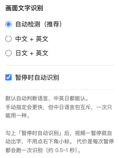

# Live Text for Video

[English](README.md) | **简体中文** | [日本語](README.ja.md) | [한국어](README.ko.md) | [Français](README.fr.md) | [Deutsch](README.de.md) | [Español](README.es.md) | [Русский](README.ru.md)

**把 Safari 的「实况文本」搬到 Chrome：暂停视频 → 点画面右下角的小标 → 画面上的文字全部变成可拖选。**

识别用的是苹果的 **Vision 框架** —— 和 Safari「实况文本」**同一套引擎**，所以质量一致，不是"接近"。

额外好处：识别出来的文字是**真正的 DOM 文本**，所以日语词典扩展（Yomitan 等）能直接在上面悬停查词，而不仅仅是复制。


> 暂停视频、点一下右下角的小标，画面上的文字就变成可选的 —— 蓝色底纹标出的是识别到的文字位置。

---

## 它解决什么问题

Safari 暂停视频时会浮出「实况文本」按钮，画面上的文字可以直接拖选复制。

但 Chrome 没有这个能力 —— **网页沙箱里根本拿不到系统 OCR**。纯前端方案只能往浏览器里塞通用 OCR 模型，质量和速度都差一截。

这个项目用 **Chrome 扩展 + 一个本机小程序** 把 Safari 那套体验复刻到 Chrome：扩展负责界面和抓帧，本机小程序负责调用苹果的 Vision 引擎。

---

## 环境要求

| 项 | 要求 |
|---|---|
| 系统 | **macOS 13 或更高**（更低版本缺少「自动检测语言」能力） |
| CPU | Apple Silicon 或 Intel 都可以（后端是 Universal Binary） |
| 浏览器 | Chrome / Edge / Brave / Vivaldi / Opera（Chromium 系） |
| 编译后端 | 需要 Command Line Tools：`xcode-select --install` |

> **Windows / Linux 用不了** —— 识别引擎是 macOS 专属的 Vision 框架。
> **Safari 也不支持** —— 它的扩展 API 与 Chrome 体系不兼容。
> 同一台 Mac 上的**不同 macOS 用户**需要各自跑一次安装脚本（注册是用户级的）。

---

## 安装

### 第 1 步：克隆并注册

```bash
git clone https://github.com/ChenZhuo4649/live-text-for-video.git
cd live-text-for-video
./install.sh
```

脚本会依次：

1. 检查系统版本与 CPU 架构
2. 准备 OCR 后端 —— 已有可用的就跳过；否则用本机 `swiftc` 编译成 **Universal Binary**
3. 把后端位置**注册给本机所有 Chromium 系浏览器**
4. 打印装扩展的步骤

### 第 2 步：装扩展

1. 浏览器打开 `chrome://extensions`
2. 打开右上角 **「开发者模式」**
3. 点 **「加载已解压的扩展程序」**，选中仓库里的 `extension/` 目录

装好后扩展 ID 应该显示为：

```
hmigekegioajglfmifdfofilgigpbcah
```

> **这个 ID 由扩展内置的公钥决定，与安装路径无关。**
> 换电脑、换目录、换浏览器，都是同一个 —— 所以注册脚本不需要你手工抄 ID。

如果显示的不是这个 ID，把扩展**移除后重新加载**一次。

---

## 怎么用

1. 打开任意视频页面（YouTube / B 站 / 任何网站）
2. **暂停**
3. 画面**右下角浮出一个小圆标**
4. **点它**
5. 等约 0.5~1 秒 —— 画面上的文字变成可拖选，并且会**闪一下淡蓝底色**告诉你哪里有字
6. 直接**拖选 → `Cmd+C`**
7. **再点一次小标**收起，画面恢复干净

鼠标移到文字上时，那一块会重新亮起，方便定位。

---

### 可选：暂停就自动识别



点扩展图标打开面板，勾上 **「暂停时自动识别」** —— 之后视频一暂停就自动出字，
不用再点右下角的小标。

代价是每次暂停都会跑一次识别（约 0.5~1 秒），所以**默认关闭**。

## 识别效果（实测数据）

| 内容类型 | 表现 |
|---|---|
| 网址、代码、大字号高对比文字 | ✅ 满分，一字不差 |
| 中文 / 日文字幕 | ✅ 满分 |
| 密集终端小字 | ✅ 128 行里 72% 满分 |
| 低对比度灰字 | ❌ 会崩，但置信度会掉到 0.3（可据此判断哪些结果不可信） |

耗时：一般画面 **0.5~1 秒**；密密麻麻的终端画面约 **1.1 秒**。

---

## 语言设置

**默认自动判断语言**（调用 Vision 的 `automaticallyDetectsLanguage`），中英日通吃，无需手动切换。

> **为什么不能"中日都给"**：Vision 的语言包是**互斥**的。
> 同时给出 `ja-JP` 和 `zh-Hans` 时，中文会被日化成繁体或日文汉字变体
> （师→姉、试→試、给→給、这→汶），而且耗时翻近一倍。
> 实测同一张日文试卷：只给 `zh-Hans` 出 **11 行**，`auto` 出 **44 行**。

如果确定画面只有一种语言，手动指定会更**快**：点扩展图标 → 选「中文 + 英文」或「日文 + 英文」，立即生效。

---

## 配合日语词典扩展（Yomitan 等）

文字层**刻意留在普通 DOM 里**（没有封进 Shadow DOM）—— 这样 Yomitan 这类词典扩展能扫到它，
**按住 Shift 悬停即可查词**，不用先把文字复制出去。

为此做了三处专门适配：

| 适配 | 为什么 |
|---|---|
| `color: #fff` + `-webkit-text-fill-color: transparent` | 词典扩展会看 `color` 判断"这是不是可见正文"，直接写 `transparent` 可能被跳过。这样写颜色是白的、只是渲染透明，视觉上一样看不见 |
| **两步宽度校准**（自适应字号 + 字距微调） | 词典按「鼠标坐标 → 字符序号」查词。若渲染宽度与画面实际宽度不符，字符序号会随位置**累积偏移** —— 症状是「行首的词查得准，越靠行尾偏得越多」 |
| 含 CJK 的文本把**半角空格换成全角** | OCR 常给半角空格（宽度只有全角约 1/4），会让空格后面的字整体前移 |

**两步校准的做法**：

```js
// 第一步：按实际渲染宽度反推合适的字号
//（只调字距的话，字号偏大时字符会被压得互相重叠，既显得挤、定位也变钝）
newSize = curSize * (目标宽度 / 自然宽度)      // 限制在 0.6~1.7 倍，防 OCR 误差拉飞

// 第二步：剩余误差用 letter-spacing 收尾
letterSpacing = (目标宽度 - 自然宽度) / (字符数 - 1)
```

实测校准后**宽度误差为 0、字距约 0**。

> ⚠️ **不要用 `transform: scaleX` 做这个校准** —— 它会干扰鼠标命中判定，导致拖选和悬停定位失效。

---

## 它是怎么工作的

```
video 暂停
   └→ content.js 在画面右下角画一个小标（自己的 DOM，不碰播放器）
        └→ 你点一下
             ├→ sw.js 调 chrome.tabs.captureVisibleTab 截当前标签页
             │       （拿的是合成后的干净像素，因此绕开了跨域 canvas 污染）
             ├→ content.js 用 canvas 裁出视频画面区域（扣掉黑边）
             ├→ 经 Native Messaging 管道送给本机后端（本地 stdio，不联网）
             ├→ 后端用 Vision 识别，返回每行文字 + 归一化坐标 + 置信度
             └→ content.js 在画面原位叠一层「文字透明但可选中」的文本层
```

两个关键细节：

- **坐标翻转**：Vision 输出的归一化坐标原点在**左下**，CSS 原点在左上，渲染时做一次上下翻转。
- **抓帧时机**：截图前先把小标自己藏起来，否则它会被拍进画面里、被 OCR 认出来。

---

## 已知限制

| 限制 | 说明 |
|---|---|
| 播放器 UI 会被一起识别 | 抓的是**屏幕合成像素**，所以进度条、按钮文字也会被拍进去。Safari 没这问题（它拿的是视频帧本身） |
| DRM 内容不可用 | Netflix 等版权保护内容抓到的画面是黑的 |
| 极少数查词偏一个字 | 汉字/假名/数字/标点的天然宽度不同，无法完全对齐 |
| 开发者模式提示 | Chrome 冷启动会提示「请停用开发者模式扩展」，是例行提醒，不影响功能 |

---

## 故障排查

日志在**网页自己的 Console** 里（不是扩展页的）：视频页面按 `F12` → Console → 找 `[Live Text]`。

| 现象 | 原因 | 怎么办 |
|---|---|---|
| 小标不出现 | 页面没加载完，或该站不是用 `<video>` 播放 | 刷新页面 |
| 报 `本机 OCR 后端未连接：...forbidden` | 注册文件里没有你这个扩展 ID | 重跑 `./install.sh`；仍不行就重启浏览器 |
| 报 `Error when communicating with the native messaging host` | 后端启动失败 | 手动执行 `./host/livetext-ocr --help`，看它能不能跑 |
| 报 `画面里没有识别到文字` | 这一帧确实没字，或字太小 | 换个有字的画面 |
| 识别出乱码 | 语言判断错了 | 点扩展图标手动指定语言 |

---

## 卸载

1. `chrome://extensions` → 找到 **Live Text for Video** → **移除**
2. 删掉注册文件（按需，路径中的浏览器名可换成 Chromium / BraveSoftware/Brave-Browser / Microsoft Edge / Vivaldi 等）：

```bash
rm "$HOME/Library/Application Support/Google/Chrome/NativeMessagingHosts/com.livetext.videoocr.json"
```

3. 删掉仓库目录

**对其他扩展零影响**，不留残留。

---

## 隐私

**图片不离开你的电脑。** 整条链路是：

```
扩展抓帧 → 本地 stdio 管道 → 本机 Vision OCR → 返回文字
```

没有任何网络请求，没有云端 API，没有遥测。

---

## 开发

### 目录结构

```
live-text-for-video/
├── install.sh                    一键安装：准备后端 + 注册
├── host/
│   ├── livetext-ocr.swift        后端源码（OCR / draw / langs / stdio 四种模式）
│   ├── build.sh                  编译 Universal Binary（arm64 + x86_64）
│   └── livetext-ocr              编译产物（被 .gitignore 排除）
├── extension/
│   ├── manifest.json             含 key（公钥）以固定扩展 ID
│   ├── content.js                注入页面的主逻辑
│   ├── content.css               小标与文本层样式
│   ├── sw.js                     service worker（截图 + 转发）
│   ├── popup.html / popup.js     语言切换面板
│   └── icons/
├── poc/                          协议自测工具与测试图
└── PoC-结果报告.md                识别质量的完整实测数据
```

### 改了代码怎么生效

| 改了什么 | 怎么生效 |
|---|---|
| `extension/` 下的 js / css / html | 在 `chrome://extensions` 点该扩展的**刷新**，再刷新视频页面 |
| `host/` 下的 Swift 源码 | 重跑 `./build.sh`，**不用重启浏览器**（每次调用都会重新拉起后端进程） |
| 注册清单本身 | 重跑 `./install.sh`；仍不生效再重启浏览器（清单有缓存） |

### 后端也能单独用（不经过浏览器）

```bash
cd host
./livetext-ocr ../poc/real_easy.jpg                    # 识别，输出 JSON
./livetext-ocr ../poc/real_easy.jpg --min-conf=0.5     # 过滤低置信度
./livetext-ocr ../poc/real_easy.jpg --langs=auto       # 自动检测语言（默认）
./livetext-ocr langs                                   # 列出本机支持的语言
./livetext-ocr draw 图片.png 结果.json -o 框图.png      # 把识别框画回图上，肉眼校验坐标
```

### 独立测试通信协议

不用浏览器也能验证「4 字节长度前缀 + JSON」这层协议：

```bash
python3 poc/test_stdio.py host/livetext-ocr poc/real_easy.jpg
```

---

## License

MIT
